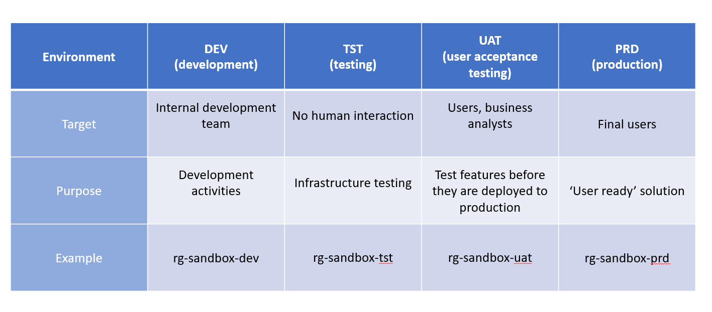

:::::::::::::::::::::::::::::::::::::: questions 

1.	Understand the concept of data layers and their uses.
2.	Understand the concept of containers and their function in storage accounts.
3.	Understand the difference and relationship between different data layers and containers.

::::::::::::::::::::::::::::::::::::::::::::::::

::::::::::::::::::::::::::::::::::::: objectives

1.	Define and explain the concept of data layers in databases and their uses for organising and transforming data.
2.	Define and explain the concept of containers in the context of storage accounts, and their role in separating data layers.
3.	Clarify the difference and relationship between data layers and containers using practical examples.

::::::::::::::::::::::::::::::::::::::::::::::::
## Understanding the Concept of Working Environments
A working environment, in a broad sense, is a configured setting where certain tasks are carried out primarily. This setting provides the appropriate tools, resources, and permissions necessary for those activities. In regard to data management and software development, working environments are tailored spaces designed to handle different stages of development, testing, deployment, and usage.

The purpose of distinct working environments is to ensure different work stages can take place simultaneously without interfering with each other. It allows for continuous development, testing, and deployment of code for applications, ensuring efficient tracking and fixing of bugs, and a smooth release and use of the final product.

## Different Kinds of Working Environments
There are typically four main types of environments you will find in a working cycle:
1.	Development Environment: This is the initial stage, where developers brainstorm, write, and revise code. The development environment is typically a developer's local machine or system, equipped with necessary tools and languages.
2.	Testing Environment: After development, the code moves to the testing environment. It is a separate area that mirrors the production environment but is solely used for testing the code for potential bugs, errors and performance issues.
3.	User Acceptance Testing (UAT) Environment: Here, a selected group of end-users use and validate the functionality of the application or system before it's moved into production. This space checks the application's alignment with user expectations and requirements.
4.	Production Environment: The final stage where the tested, confirmed product is released for end users. This is the live environment and any changes or errors directly affect the application's functioning and user experiences.
Each of these environments has its users - developers, testers, specific end-users, and all end-users respectively.

To conclude, the precise use, configuration, and management of working environments are integral to a successful software development and deployment process. They ensure a systematised, efficient progression from code writing to an application's deployment, providing stages to check and validate code functionality, scalability, and user satisfaction.

:::::::::::::::::::::::::::::::::::::::::::::::::::::::::::::::::::: instructor

Inline instructor notes can help inform instructors of timing challenges
associated with the lessons. They appear in the "Instructor View"

::::::::::::::::::::::::::::::::::::::::::::::::::::::::::::::::::::::::::::::::

::::::::::::::::::::::::::::::::::::: challenge 

## Challenge 1: What type of data can you usually consume in a production environment? 

- a) Raw format data 
- b) Curated data 
- c) Development data 
- d) Data in its native format

:::::::::::::::::::::::: solution 
 
b) Curated data

::::::::::::::::

## Challenge 2: What are the four working environments in the QESD platform?
 
 - a) User, Landing, Raw, Curated 
 - b) Ingested, Transformed, Organized, Consumed 
 - c) Development, Testing, Production, Consumption 
 - d) Development, Testing, Production, Sandbox
  
:::::::::::::::::::::::: solution 

a) User, Landing, Raw, Curated 

:::::::::::::::::::::::::::::::::
:::::::::::::::::::::::::::::::::

