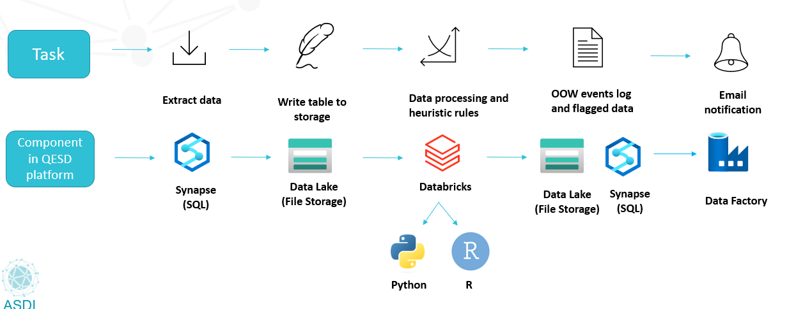

:::::::::::::::::::::::::::::::::::::: questions 

1.	What is a data lake?
2.	What are some of the features of a data lake?

::::::::::::::::::::::::::::::::::::::::::::::::

::::::::::::::::::::::::::::::::::::: objectives

1. Understand the concept of the QESD platform as a data lake.
2. Explain the ability to store raw data in its native format.
3. Analyze the scalability and integration of analysis and machine learning tools in the platform.
4. Demonstrate knowledge of monitoring and management tools for data usage and cost prediction.

::::::::::::::::::::::::::::::::::::::::::::::::
## The QESD Platform as a Data Lake
 This lesson centres on the concept of a 'Data Lake', employing the Queensland Environmental Science Data (QESD) Platform as an example. This discussion will provide insights into what a Data Lake is, its key features, and why it's significant in any data architecture.

## Understanding a Data Lake with QESD
A 'Data Lake' is a holistic, centralised repository designed to store a vast amount of raw data in its native format regardless of the source. The QESD platform is an excellent example of a data lake employed by the Queensland government, capable of ingesting and safekeeping an expansive range of data types from diverse sources.
The QESD platform provides a flexible, comprehensive, and scalable solution for managing the government's data needs. It accepts raw data as-is, minimising the time taken to organise and format data before its storage. This feature enables QESD to serve as a single 'source of truth', offering a coherent and accessible database that fuels various analytics and decision-making processes.

# Key Features of Data Lakes
Data lakes, including the QESD platform, come with an array of features that help manage, access, and utilise data efficiently. Some of the key features include:
1.	Integration with Analysis and Machine Learning Tools: The QESD platform enables integration with various tools for data analysis and machine learning. It allows conducting advanced analytics, insights mining, predictive analytics, and machine learning over the stored raw data.
2.	Scalability: Data lakes are designed to be flexible and scalable, accommodating varying data intensities. As the Queensland Government's diverse departments generate and use data, QESD can effortlessly scale up or down to meet the fluctuating data demands.
3.	Monitoring and Management Tools: The QESD platform, like other data lakes, implements monitoring and management tools ensuring data protection, integrity, and accessibility. These tools help maintain the security of sensitive data, track data usage, and ensure total governance over the lake's resources.
In summary, a data lake like QESD serves as a comprehensive, centralised data repository that not only preserves raw data from multiple sources, but also enables robust data analysis, ensures scalability, and provides efficient management tools.

:::::::::::::::::::::::::::::::::::::::::::::::::::::::::::::::::::: instructor

Inline instructor notes can help inform instructors of timing challenges
associated with the lessons. They appear in the "Instructor View"

::::::::::::::::::::::::::::::::::::::::::::::::::::::::::::::::::::::::::::::::

::::::::::::::::::::::::::::::::::::: challenge 

## Challenge 1: What is one of the main features of implementing the QESD platform as a data lake? 

- a) Ability to hold raw data in its native format 
- b) Management of logical representation of data 
- c) Restructuring of data 
- d) Development of new views in a particular solution? 

:::::::::::::::::::::::: solution 
 
a) Ability to hold raw data in its native format 

::::::::::::::::

## Challenge 2: What is equivalent to a "blob" in Azure? 

- a) A view 
- b) A file 
- c) A container 
- d) A bouncing cell? 

  :::::::::::::::::::::::: solution 

b) A file

:::::::::::::::::::::::::::::::::
:::::::::::::::::::::::::::::::::

